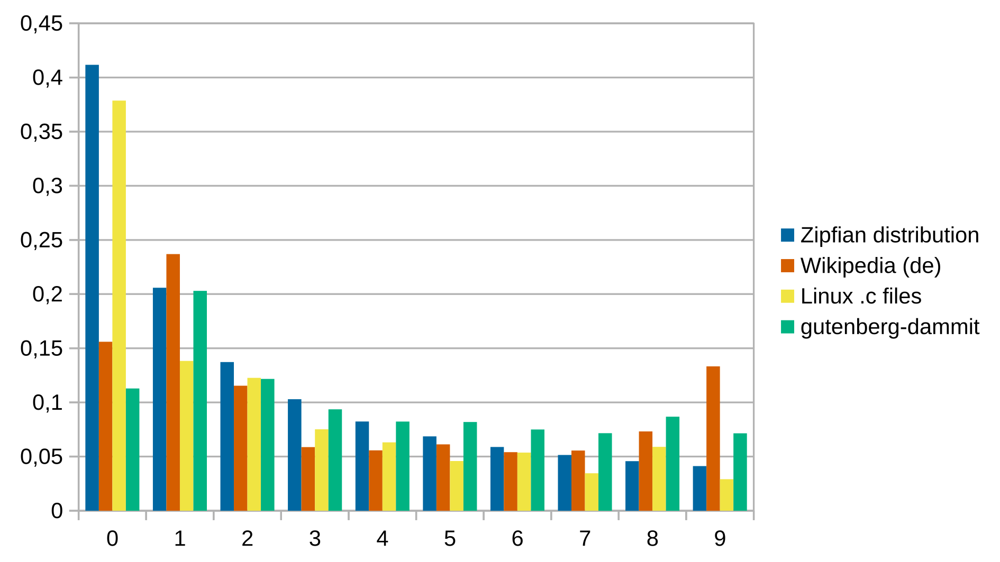

**Estimated reading time:** 5 minutes

# Optimization potential

What's there to optimize? Ignoring some special cases, aren't all 10 digits used approximately equally?

Surprisingly to me, no. A lot of real world data has a [Zipfian distribution](https://en.wikipedia.org/wiki/Zipf%27s_law), which means the frequency of any X is inversely proportional to its rank in the frequency table. For example, in texts, the most frequent word will occur approximately twice as often as the second most frequent word, three times as often as the third most frequent word, and so on. ("the" is the most common word with about 7%, while the second most common "of" has 3.5%)

And again, this comes up a lot in all kinds of data (Wikipedia quote):

> The same relationship occurs in many other rankings of human created systems, such as the ranks of mathematical expressions or ranks of notes in music, and **even in uncontrolled environments**, such as the population ranks of cities in various countries, corporation sizes, [...]

([The Zipf Mystery](https://www.youtube.com/watch?v=fCn8zs912OE) is a great video about this topic, but it's not necessary to watch for this post. There's also [Benford's law](https://en.wikipedia.org/wiki/Benford's_law), which states that "in many naturally occurring collections of numbers, the leading digit is likely to be small.")

One intuitive way I can think of for why it's true for numbers is this: A lot of text and code includes something that's akin to numbered lists. Some of these lists will end on 3, some on 701 and some on 41591878, but most of them will start with 0 or 1. Since that's the case but the higher numbers often aren't reached, it leads to 1 being more common than 2, 2 more common than 3, and so on.

To be sure, I [checked three gigantic collections of texts](corpus_count.py): A selection from project Gutenberg (public domain library of books, 6.4 GiB compressed, plain text only), Wikipedia (5.8 GiB, de, sanitized) and all C files of the Linux kernel.

Here you can see the plot: 

And indeed, the datasets mostly follow a Zipfian distribution. Of course, data is almost never free from noise and bias. For example, I think it's likely that the outliers of 8 and 9 in Wikipedia are largely caused by the fact that there's a lot of information about the 19th and 20th century (and less and less, the more you go into the past). It's also not surprising that 0 is a lot more common in code than in texts, given that indexes and counters usually start with 0. But it means that we need to handle 0 separately, as the Zipfian frequency for 0 does not seem to apply in non-programming areas.

So with that we have:

**Premise 1**: You type some numbers more often than others.

But we also need the following to get any optimization off the ground:

**Premise 2**: Some key positions are better in terms of comfort, ease, speed, or else

For example, if you agree that the key that's currently used for 1 is the least comfortable, then the data shows us that the current layout (`12345 67890`) is not optimal: The digit 1 is the most common digit (or second most common, if you program a lot), yet it is in the worst position. I actually didn't realize this before working on this thing, but I actually use my ring finger to type 1's. That's how bad it is for me.

Obviously, changing the number row is of no use if it makes your life harder (after you got used to the new arrangement):

**Premise 3**: You don't have to switch, or it's easy for you to switch between a new and the traditional layout.

If any of these premises doesn't hold true for you, then changing the number row provides no benefits.

Now that we got that covered, let's look at finding your best digit arrangement. 
 

# Optimization
The [Python script](find_optimal_num_rows.py) I've written uses the previously mentioned digit distribution and several variables one can change to find the optimal arrangements. It does so by going through and rating every single one of the *10! = 3 628 800* permutations. On top of that it also rates the ones you've manually entered.

The most important variable defines how comfortable, easy and fast you find each key to type on (for the left side). It has a default of `[0.55, 0.8, 1, 0.98, 0.72]`

Your values will likely be a lot less extreme if you use a separate layer for numbers with more optimal placements. But even then you might want to put less common digits on your pinkies.

# Results
The "penalty" in the following refers to the imbalance penalty, which is calculated using the difference between the average digit frequency of left and right keys. It also depends on how high the `IMBALANCE_PENALTY_FACTOR` is.

## Current layout
| arrangement | penalty | left  | right | total |
|-------------|--------:|------:|------:|-------|
| 12345 67890 | 1.68113 | 10.59 |  7.42 | 16.33 |

## Worst permutation
| arrangement | penalty | left  | right | total | change from current |
|-------------|--------:|------:|------:|------:|--------------------:|
| 02431 68975 | 7.02832 | 13.68 |  4.81 | 11.47 | -29.77%             |

## Best permutations
| arrangement | penalty | left  | right | total | change from current |
|-------------|--------:|------:|------:|------:|--------------------:|
| 95037 62148 | 0.05325 | 11.25 | 11.00 | 22.20 | +35.97%             |
| 95037 61248 | 0.05317 | 11.25 | 10.97 | 22.17 | +35.77%             |
| 97035 62148 | 0.05317 | 11.22 | 11.00 | 22.17 | +35.77%             |
| 64128 73059 | 0.05313 | 11.25 | 10.95 | 22.15 | +35.65%             |
| 97035 61248 | 0.05310 | 11.22 | 10.97 | 22.14 | +35.58%             |

## Best where digits stay on their current side
| arrangement | penalty | left  | right | total | change from current |
|-------------|--------:|------:|------:|------:|--------------------:|
| 53124 86079 | 2.04471 | 12.07 |  9.84 | 19.86 | +21.63%             |

## Best with at most two swaps
| arrangement | penalty | left  | right | total | change from current |
|-------------|--------:|------:|------:|------:|--------------------:|
| 17345 62098 | 0.60548 | 9.00  | 11.71 | 20.10 | +23.08%             |

(swap 2 with 7 and 8 with 0)

## Best with at most three swaps
| arrangement | penalty | left  | right | total | change from current |
|-------------|--------:|------:|------:|------:|--------------------:|
| 87305 62194 | 0.19565 | 11.20 | 10.70 | 21.71 | +32.97%             |
 
(swap 1 with 7, 1 with 3 and 8 with 0)

# Best, most balanced
| arrangement | penalty | left  | right | total | change from current |
|-------------|--------:|------:|------:|------:|--------------------:|
| 75046 91238 | 0.04000 | 11.04 | 11.06 | 22.05 | +35.08%             |

## Manually entered
| arrangement | penalty | left  | right | total | change from current |
|-------------|--------:|------:|------:|------:|--------------------:|
| 54321 06789 | 1.84554 | 11.36 |  8.41 | 17.92 | +9.78%              |
| 43215 90678 | 2.02587 | 11.98 |  9.72 | 19.68 | +20.51%             |
| 72145 63098 | 0.43408 | 11.01 | 10.92 | 21.50 | +31.67%             |

So, there you have it. While I mostly made this for fun, I'm considering to use `43215 90678` in my next layout.

**Thank you very much for reading!**

---

**TLDR**: Use `53124 86079` if you want numbers to stay on their side. Use `84126 73059` if you want the absolute best rating. Use `54321 06789` if you want an easy to remember change (reverse left side, move 0 right to 1). Use `17345 62098` if you only want to swap two digits (2 with 7 and 8 with 0) and still get about two thirds of the maximum benefits.

Of course, the best number arrangement will depend on your preferences and what you do most on your computer. So, if you're going for the best possible result, you probably need to modify a few of the parameters and run the script yourself.